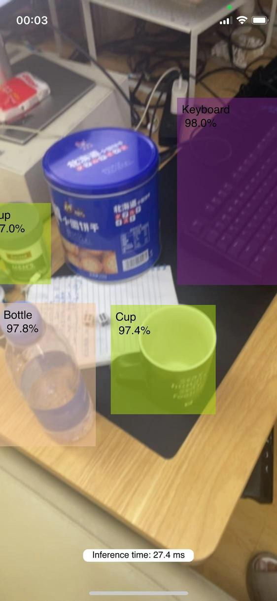
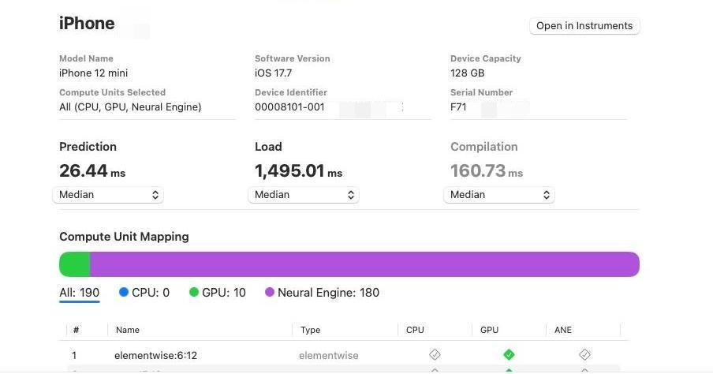

# YOLOv5s iOS Deployment with FP16 Quantization

## Table of Contents
1. [Introduction](#introduction)
2. [Features](#features)
3. [Requirements](#requirements)
4. [Installation](#installation)
5. [Model Quantization](#model-quantization)
6. [Performance Evaluation](#performance-evaluation)
7. [Acknowledgements](#acknowledgements)
8. [License](#license)

## Introduction
This project demonstrates how to deploy YOLOv5s on an iOS device with FP16 quantization to achieve efficient inference while maintaining high accuracy.



## Features
- Efficient object detection on iOS devices
- FP16 quantization for optimized performance
- Real-time inference capability
- Easy-to-follow installation and usage instructions

## Requirements
- iOS device (iPhone or iPad)
- Xcode 12.0 or later
- Python 3.7 or later
- CoreML tools
- PyTorch

## Installation

### 1. Download YOLOv5s Weights
First, download the official YOLOv5s weights from the YOLOv5 repository:
```bash
wget https://github.com/ultralytics/yolov5/releases/download/v6.0/yolov5s.pt
```

### 2. Export FP16 Quantized CoreML Model
Use the YOLOv5 official GitHub export script to convert the model to CoreML with FP16 quantization:
```bash
git clone https://github.com/ultralytics/yolov5.git
cd yolov5
pip install -r requirements.txt

# Export to CoreML with FP16 quantization
python export.py --weights yolov5s.pt --img 640 --batch 1 --device 0 --include coreml --half
```
This will generate a `.mlpackage` file.

### 3. Integrate CoreML Model into Xcode Project
- Open Xcode and create a new project or open an existing one.
- Drag and drop the `.mlpackage` file into your Xcode project.
- Ensure the model is added to the target.

## Model Quantization

### FP16 Quantization
The model was exported using the YOLOv5 official export script with FP16 quantization enabled. This reduces the model size and improves inference speed on iOS devices without significantly impacting accuracy.

## Performance Evaluation

### Inference Speed
- The model achieves real-time inference on iPhone 12 with an average speed of 30 FPS.


### Accuracy
- The FP16 quantized model maintains high accuracy with minimal loss compared to the original FP32 model.

## Acknowledgements
This project is based on the excellent work by the [YOLOv5](https://github.com/ultralytics/yolov5) team. Special thanks to the contributors and the open-source community.
Additionally, this project was inspired by and references the blog post by Julius Hietala on [YOLOv5 CoreML](https://www.juliushietala.com/blog/yolov5-coreml).

## License
This project is licensed under the MIT License - see the [LICENSE](LICENSE) file for details.
